<div align="center">
  
  <h1>SheetForge</h1>
  <p><strong>The modern, streaming Excel engine for the web.</strong></p>
  
  [](https://www.npmjs.com/package/@sheetforge/core)
  [](https://opensource.org/licenses/MIT)
  [](http://makeapullrequest.com)

  <p>
    <a href="#features">Features</a> •
    <a href="#installation">Installation</a> •
    <a href="#quick-start">Quick Start</a> •
    <a href="#pro-tier">Pro Tier</a> •
    <a href="#benchmarks">Benchmarks</a>
  </p>
</div>

---

**SheetForge** is a zero-dependency, ultra-fast streaming parser and writer for OpenXML (`.xlsx`) files. Built on native Web APIs (like `TransformStream` and Web Crypto), it handles millions of cells with a completely flat memory profile.

Unlike DOM-based AST parsers (like ExcelJS or SheetJS), SheetForge processes files chunk-by-chunk on the fly, making it perfect for Edge environments (Cloudflare Workers, Vercel Edge, Next.js Server Actions) and client-side browser usage without crashing the heap.

## ✨ Features

- **Zero Dependencies**: Pure modern TypeScript, leveraging native browser/Node Web APIs.
- **True Streaming**: Parse gigabytes of Excel data using `ReadableStream` with almost zero memory overhead.
- **Edge Native**: Fully compatible with Node.js, Deno, Bun, Cloudflare Workers, and modern browsers.
- **Read & Write**: Stream massive `.xlsx` files and generate them on the fly.
- **Styles & Formulas (Pro)**: Fully supported conditional formatting, typography, fills, and formula evaluation via the Dead-Drop encryption architecture.

## 📦 Installation

```bash
# npm
npm install @sheetforge/core

# pnpm
pnpm add @sheetforge/core

# yarn
yarn add @sheetforge/core
```

## 🚀 Quick Start

### Parsing an Excel File (Streaming)

```typescript
import { SheetReader } from '@sheetforge/core';

const reader = new SheetReader();
const stream = await fetch('https://example.com/massive-data.xlsx').then(r => r.body!);

// Parse the first sheet encountered (or specify sheetName in options)
const rows = await reader.parse(stream, { sheetName: 'Sheet1' });

for await (const row of rows) {
  console.log(row); // ['ID', 'Name', 'Amount']
  
  // Memory stays flat no matter how large the file is!
}
```

### Writing an Excel File

```typescript
import { SheetWriter } from '@sheetforge/core';

const writer = new SheetWriter();

writer.addRow(['Header 1', 'Header 2', 'Header 3']);
writer.addRow([1, 2, 3]);
writer.addRow(['Data', 'More Data', 'Even More Data']);

const blob = await writer.generateBlob();
// Download or save the .xlsx Blob!
```

## 💎 Pro Tier

SheetForge Core is entirely open-source (MIT). For advanced styling and formula evaluation, we offer a **Pro Tier** for just **$5 PPP**. 

The Pro Tier includes:
- **`StyleEngine`**: Cell typography (fonts, bold, italic), cell fills (solid, gradients), borders, and alignments.
- **`FormulaEngine`**: Evaluate math, logic, and lookup functions on the fly.
- **`ConditionalFormatter`**: Apply data bars, color scales, and icon sets.

### Activating Pro

No databases, no SaaS subscriptions, and no external network calls required. Simply purchase a one-time license key and pass it into the `ProEngine` to unlock advanced features instantly.

```typescript
import { SheetWriter } from '@sheetforge/core';
import { ProEngine } from '@sheetforge/core/pro';

// 1. Initialize Pro Engine with your 5$ PPP license payload
const pro = new ProEngine(process.env.SHEETFORGE_LICENSE);

// 2. Pass it to the writer
const writer = new SheetWriter({ proEngine: pro });

// 3. Use Pro styling!
writer.addRow([
  pro.styleEngine.apply({ value: 'Total Revenue', font: { bold: true } }),
  pro.formulaEngine.create('SUM(B2:B100)')
]);
```

## 📊 Benchmarks

Because SheetForge parses chunks continuously rather than building an Abstract Syntax Tree (AST) in memory, its memory footprint remains effectively flat regardless of file size.

Benchmarks were run on a standard development machine under **Node v25.8.2** using `--expose-gc` to measure clean heap deltas.

### 1M Numbers (10 cols × 100k rows)

```mermaid
gantt
    title Write Time — 1M Numbers
    dateFormat  X
    axisFormat %s ms

    section SheetForge v0.2
    3939 ms   :done, 0, 3939
    
    section SheetJS (est.)
    6500 ms   :active, 0, 6500
    
    section ExcelJS (est.)
    12000 ms  :crit, 0, 12000
```



| Metric | SheetForge v0.3 | SheetJS (est.) | ExcelJS (est.) |
|---|---|---|---|
| **Write Time** | **3,714 ms** | ~6,500 ms | ~12,000 ms |
| **File Size** | **2.9 MB** | ~3.1 MB | ~3.0 MB |
| **Read Time** | **5,524 ms** | ~11,000 ms | ~26,000 ms |
| **Peak Heap (Read)** | **+54.9 MB** | ~180 MB | ~450 MB |

### 1M Duplicate Strings (best case for SST deduplication)

| Metric | SheetForge v0.3 |
|---|---|
| **Write Time** | **4,808 ms** |
| **File Size** | **2.6 MB** (SST dedup compresses well) |
| **Read Time** | **3,968 ms** |
| **Peak Heap (Read)** | **+53.5 MB** |

### 1M Unique Strings (worst case — large SST)

| Metric | SheetForge v0.2 |
|---|---|
| **Write Time** | **7,941 ms** |
| **File Size** | **9.2 MB** |
| **Read Time** | **6,593 ms** |
| **Peak Heap (Iteration)** | **+8.6 MB** |

*\* Memory footprint remains flat for numerical data and repetitive strings. Highly unique string-heavy files will consume memory relative to the size of the shared string table — the SST is loaded into a Map before sheet iteration begins.*

---

## 📋 Changelog

### v1.0.0 (Official Release)
> True O(1) Streaming Architecture for Writers & Editors

- **O(1) Memory Streaming Writer & Editor** — Ripped out in-memory buffers. `SheetWriter` and `SheetEditor` now use `ZipStreamWriter` via Data Descriptors (Bit 3) to generate dynamic ZIP archives entirely on-the-fly, reducing memory overhead to O(1) flat.
- **Dynamic Date Deserialization** — Robust detection of `numFmtId` across workbooks to reliably auto-convert numeric epoch dates back into strict ISO-8601 strings during stream parsing.
- **Data Descriptors & Signature Scanning** — Fixed limitations with forward-only zip stream parsers by scanning for Data Descriptor headers `0x08074b50`, achieving zero-seek streaming parsing of workbooks.
- **Production Ready** — Validated by extensive tests and rigorous benchmarking.

---

### v0.3.0-beta
> Multi-Sheet Support, Auto Date Deserialization, & Massive XML Parsing Optimization

- **Multi-Sheet Writing** — You can now use `writer.addSheet()` multiple times to chain worksheets into a single exported `.xlsx` workbook.
- **Dynamic XML Structuring** — The zip packer dynamically adjusts `[Content_Types].xml`, `workbook.xml`, and relationships files.
- **Auto Date Deserialization** — `SheetReader` now pre-fetches `styles.xml` from the stream, parses `<cellXfs>` and `<numFmts>`, and heuristically identifies cells with date formats. Numeric Excel epoch dates are automatically mapped directly to strict `ISO-8601` strings!
- **Exponential XML Stream Bug Fixed** — Found and eliminated an $O(N^2)$ buffer accumulation bug in `xml-stream.ts`. Reading 1 Million cells now parses fully in under ~4 seconds (down from ~6.4s) while consuming <60MB of peak heap overhead.
- **Portal App Update** — The interactive `/apps/portal` demo now dynamically exports workbooks containing 2 distinct sheets and verified Date cells.

---

### v0.2.0-beta
> Native Deflate Compression & Rich Text Support

- **SheetWriter is now async** — `write()` returns `Promise<Uint8Array>`
- **Native Deflate compression** via `CompressionStream('deflate-raw')` — no dependencies
- **ZIP binary upgraded** — compression method `0x08`, correct uncompressed size & CRC-32 in headers
- **File size reduction**: 1M cell file went from **30 MB → 2.9 MB** (90% smaller)
- **Read speed improved**: parse time dropped from **~9.4s → 6.4s** (less I/O from smaller file)
- **Rich Text / Inline String support** — `SheetReader` now parses `<t>` inside `<is>` and `<r>` elements
- **Type fixes**: `@types/node` added, `TextDecoderStream` cast resolved
- **ZIP backpressure deadlock** permanently fixed via concurrent background pump

#### v0.2.0-beta vs v0.1.0-beta comparison

| Metric | v0.1.0-beta | v0.2.0-beta | Delta |
|---|---|---|---|
| File size (1M cells) | 30 MB | 2.9 MB | **−90%** |
| Write time | ~3,600 ms | ~3,900 ms | ~+8% (compression overhead) |
| Read time | ~9,400 ms | ~6,400 ms | **−32%** (less disk I/O) |
| ZIP Compression | Store (none) | Deflate (native) | ✅ |
| Async write API | ❌ sync | ✅ async | ✅ |
| Rich text cells | ❌ | ✅ | ✅ |

---

### v0.1.0-beta
> Initial Release

- Streaming SAX-style XLSX parser (`SheetReader`)
- Zero-dependency XLSX writer (`SheetWriter`) with Store compression
- ZIP stream parser built on native `TransformStream`
- Shared String Table (`xl/sharedStrings.xml`) support
- Pro tier architecture: `StyleEngine`, `FormulaEngine`, `ConditionalFormatter`
- Dead-Drop license system (Zero-DB, hardware-bound, offline)
- Next.js Portal (`apps/portal`) with interactive playground

---

## 📄 License

The Core engine is licensed under the MIT License. Pro features are governed by a separate commercial license. 

---
<div align="center">
  Built with 💻 and ☕ for modern web developers.
</div>
