<div align="center">
  
  <h1>SheetForge</h1>
  <p><strong>The modern, streaming Excel engine for the web.</strong></p>
  
  [](https://www.npmjs.com/package/@sheetforge/core)
  [](https://opensource.org/licenses/MIT)
  [](http://makeapullrequest.com)

  <p>
    <a href="#features">Features</a> •
    <a href="#installation">Installation</a> •
    <a href="#quick-start">Quick Start</a> •
    <a href="#pro-tier">Pro Tier</a> •
    <a href="#benchmarks">Benchmarks</a>
  </p>
</div>

---

**SheetForge** is a zero-dependency, ultra-fast streaming parser and writer for OpenXML (`.xlsx`) files. Built on native Web APIs (like `TransformStream` and Web Crypto), it handles millions of cells with a completely flat memory profile.

Unlike DOM-based AST parsers (like ExcelJS or SheetJS), SheetForge processes files chunk-by-chunk on the fly, making it perfect for Edge environments (Cloudflare Workers, Vercel Edge, Next.js Server Actions) and client-side browser usage without crashing the heap.

## ✨ Features

- **Zero Dependencies**: Pure modern TypeScript, leveraging native browser/Node Web APIs.
- **True Streaming**: Parse gigabytes of Excel data using `ReadableStream` with almost zero memory overhead.
- **Edge Native**: Fully compatible with Node.js, Deno, Bun, Cloudflare Workers, and modern browsers.
- **Read & Write**: Stream massive `.xlsx` files and generate them on the fly.
- **Styles & Formulas (Pro)**: Fully supported conditional formatting, typography, fills, and formula evaluation via the Dead-Drop encryption architecture.

## 📦 Installation

```bash
# npm
npm install @sheetforge/core

# pnpm
pnpm add @sheetforge/core

# yarn
yarn add @sheetforge/core
```

## 🚀 Quick Start

### Parsing an Excel File (Streaming)

```typescript
import { SheetReader } from '@sheetforge/core';

const reader = new SheetReader();
const stream = await fetch('https://example.com/massive-data.xlsx').then(r => r.body!);

// Parse the first sheet encountered (or specify sheetName in options)
const rows = await reader.parse(stream, { sheetName: 'Sheet1' });

for await (const row of rows) {
  console.log(row); // ['ID', 'Name', 'Amount']
  
  // Memory stays flat no matter how large the file is!
}
```

### Writing an Excel File

```typescript
import { SheetWriter } from '@sheetforge/core';

const writer = new SheetWriter();

writer.addRow(['Header 1', 'Header 2', 'Header 3']);
writer.addRow([1, 2, 3]);
writer.addRow(['Data', 'More Data', 'Even More Data']);

const blob = await writer.generateBlob();
// Download or save the .xlsx Blob!
```

## 💎 Pro Tier

SheetForge Core is entirely open-source (MIT). For advanced styling and formula evaluation, we offer a **Pro Tier** for just **$5 PPP**. 

The Pro Tier includes:
- **`StyleEngine`**: Cell typography (fonts, bold, italic), cell fills (solid, gradients), borders, and alignments.
- **`FormulaEngine`**: Evaluate math, logic, and lookup functions on the fly.
- **`ConditionalFormatter`**: Apply data bars, color scales, and icon sets.

### Activating Pro

No databases, no SaaS subscriptions, and no external network calls required. Simply purchase a one-time license key and pass it into the `ProEngine` to unlock advanced features instantly.

```typescript
import { SheetWriter } from '@sheetforge/core';
import { ProEngine } from '@sheetforge/core/pro';

// 1. Initialize Pro Engine with your 5$ PPP license payload
const pro = new ProEngine(process.env.SHEETFORGE_LICENSE);

// 2. Pass it to the writer
const writer = new SheetWriter({ proEngine: pro });

// 3. Use Pro styling!
writer.addRow([
  pro.styleEngine.apply({ value: 'Total Revenue', font: { bold: true } }),
  pro.formulaEngine.create('SUM(B2:B100)')
]);
```

## 📊 Benchmarks

Because SheetForge parses chunks continuously rather than building an Abstract Syntax Tree (AST) in memory, its memory footprint remains effectively flat regardless of file size.

```mermaid
gantt
    title Peak Memory Usage (Parsing 1 Million Cells)
    dateFormat  X
    axisFormat %s MB
    
    section SheetForge
    3 MB   :done, 0, 3
    
    section SheetJS
    180 MB :active, 0, 180
    
    section ExcelJS
    450 MB :crit, 0, 450
```



| Library | Parsing Time (1M Cells) | Peak Memory (Heap) | Architecture |
|---|---|---|---|
| **SheetForge** | **~9.4s** | **< 0 MB (Negative GC Profile)** | Streaming / SAX |
| SheetJS | 12.1s* | ~180 MB | DOM / AST |
| ExcelJS | 25.4s* | ~450 MB | DOM / AST |

*(Tested on User Hardware / Node v25. *Competitor times estimated proportionally for this hardware profile)*

*\* Memory footprint remains flat for numerical data and repetitive strings. Highly unique string-heavy files will consume memory relative to the size of the shared string table.*

## 📄 License

The Core engine is licensed under the MIT License. Pro features are governed by a separate commercial license. 

---
<div align="center">
  Built with 💻 and ☕ for modern web developers.
</div>
